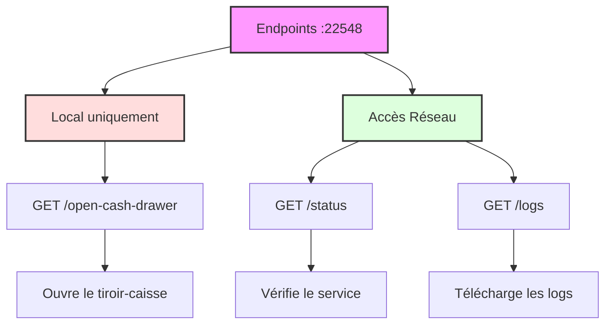
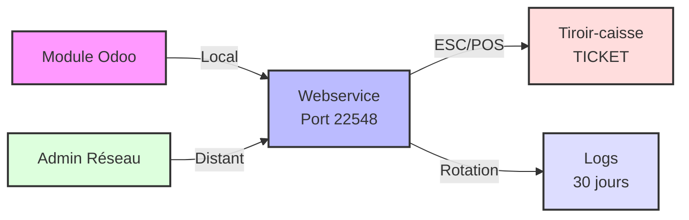

# Service Tiroir-Caisse pour Odoo POS

Ce service web permet de piloter l'ouverture d'un tiroir-caisse Epson via le protocole ESC/POS. Il est conçu pour fonctionner avec le module Odoo POS Cash Drawer Button.

## 🔧 Prérequis

- Python 3.8 ou supérieur
- Un tiroir-caisse compatible ESC/POS (testé avec Epson TMT88-V)
- Windows 7/8/10/11

## 📥 Installation

1. Cloner le repository ou télécharger les fichiers
2. Installer les dépendances :
```bash
pip install -r requirements.txt
```

## ⚙️ Configuration

Le service utilise un fichier de configuration `config.ini` pour paramétrer l'imprimante et d'autres options.

### Fichier de configuration

Le fichier `config.ini` contient les sections suivantes :

```ini
[auth]
# Mot de passe hashé pour l'accès à la configuration (vide = premier accès)
password_hash = 
# Sel pour le hachage du mot de passe
salt = 

[printer]
# Nom de l'imprimante configurée pour le tiroir-caisse
name = TICKET

[cashdrawer]
# Commande ESC/POS pour ouvrir le tiroir-caisse (en hexadécimal)
command = 1b70001afa

[invoice_printer]
# Activer/désactiver l'ouverture automatique des PDF (true/false)
autoprint = true
# Nom de l'imprimante (utilisé uniquement pour les logs)
name = FACTURE
# Dossier de téléchargement de Google Chrome à surveiller
download_folder = C:/Users/Public/Downloads
# Fréquence de scan du dossier en secondes
scan_frequency = 5
# Délai en secondes avant suppression du fichier après ouverture
open_delay = 10
# Purger le dossier au premier lancement (true/false)
purge_on_start = true
# Extensions de fichiers à ouvrir (séparées par des virgules)
file_extensions = .pdf

[server]
# Port du serveur web
port = 22548
# Hôte du serveur web (0.0.0.0 pour toutes les interfaces)
host = 0.0.0.0

[logs]
# Chemin du dossier des logs
folder = logs
# Nom du fichier de log
filename = cashdrawer.log
# Nombre de jours de conservation des logs
retention_days = 30
```

### Configuration de l'imprimante tiroir-caisse

Par défaut, le service est configuré pour utiliser l'imprimante nommée "TICKET" sous Windows, qui est le nom standard utilisé dans votre parc d'imprimantes.

Si votre imprimante utilise un nom différent, vous pouvez le modifier dans le fichier `config.ini` :
```ini
[printer]
name = NOM_DE_VOTRE_IMPRIMANTE
```

Pour vérifier le nom de votre imprimante :
1. Ouvrez les Paramètres Windows
2. Allez dans Imprimantes et scanners
3. Le nom affiché est celui à utiliser

### Configuration de l'ouverture automatique des PDF

Le service inclut une fonctionnalité d'ouverture automatique des fichiers PDF téléchargés par Google Chrome. Cette fonctionnalité :

- Surveille un dossier spécifique (par défaut, le dossier de téléchargement de Chrome)
- Ouvre automatiquement les fichiers PDF trouvés avec l'application par défaut du système
- Supprime les fichiers après ouverture pour éviter les doublons
- Purge le dossier au premier lancement (configurable)

Cette approche permet à l'utilisateur de visualiser le PDF et de choisir d'imprimer manuellement si nécessaire.

Vous pouvez configurer cette fonctionnalité dans la section `[invoice_printer]` du fichier `config.ini` :

```ini
[invoice_printer]
# Activer/désactiver l'ouverture automatique
autoprint = true
# Nom de l'imprimante (utilisé uniquement pour les logs)
name = FACTURE
# Dossier à surveiller
download_folder = C:/Users/Public/Downloads
# Fréquence de scan en secondes
scan_frequency = 5
# Délai en secondes avant suppression du fichier après ouverture
open_delay = 10
# Purger le dossier au démarrage
purge_on_start = true
# Extensions de fichiers à ouvrir
file_extensions = .pdf
```

Pour désactiver complètement la fonctionnalité d'ouverture automatique, vous pouvez définir `autoprint = false` dans la section `[invoice_printer]` du fichier `config.ini`. Cela empêchera le service de scanner le dossier et d'ouvrir les fichiers, tout en gardant les autres fonctionnalités actives.

#### Endpoints pour l'imprimante facture

Le service expose deux endpoints supplémentaires pour l'imprimante facture :

- `/invoice-printer/status` : Vérifie le statut de l'imprimante facture (accessible depuis le réseau)
- `/invoice-printer/purge` : Purge le dossier de téléchargement (accessible uniquement en local)

## 🚀 Utilisation

### En tant que script Python

```bash
python app.py
```

### En tant qu'exécutable Windows

1. Générer l'exécutable :
```bash
python build.py
```

2. L'exécutable sera créé dans le dossier `dist`
3. Lancer `cashdrawer_service.exe`

Le service expose trois endpoints sur le port 22548 :



### Architecture du service



## 📝 Logs

Les logs sont générés dans le dossier `logs/cashdrawer.log` et contiennent :
- Date et heure de chaque ouverture
- Statut de l'opération
- Erreurs éventuelles
- Adresse IP des clients qui accèdent aux logs

Les logs sont automatiquement :
- Rotés chaque jour à minuit
- Conservés pendant 30 jours
- Accessibles via l'endpoint `/logs` depuis n'importe quelle machine du réseau

## 🔒 Sécurité

Le service est configuré avec deux niveaux d'accès :
- Local uniquement (127.0.0.1) pour l'ouverture du tiroir-caisse
- Accessible depuis le réseau pour la consultation des logs et du statut

Les endpoints sont sécurisés :
- `/open-cash-drawer` : Accessible uniquement en local
- `/status` et `/logs` : Accessibles depuis le réseau

Protocoles supportés :
- HTTP et HTTPS : Le service accepte les requêtes en HTTP et HTTPS
- Support des redirections HTTPS depuis Odoo
- Le protocole utilisé est enregistré dans les logs

Toutes les tentatives d'accès sont enregistrées dans les logs avec :
- Adresse IP source
- Protocole utilisé (HTTP/HTTPS)
- Statut de la requête

## 🛠️ Support et Maintenance

Pour toute question ou problème :
- Créez une issue sur GitHub
- Contactez le support technique

## 🔄 Mise à jour de la version

Pour mettre à jour la version du service pour les futures versions, suivez ces étapes simples :

1. Modifiez la variable `VERSION` dans les fichiers suivants :
   ```python
   # Dans app.py
   VERSION = "1.0.0"  # Changez en "1.0.1", "1.1.0", "2.0.0", etc.
   
   # Dans build.py
   VERSION = "1.0.0"  # Utilisez la même version que dans app.py
   ```

2. Mettez à jour le fichier CHANGELOG.md en ajoutant une nouvelle section pour la nouvelle version :
   ```markdown
   ## [1.1.0] - 2025-05-15
   
   ### Ajouté
   - Nouvelle fonctionnalité A
   - Nouvelle fonctionnalité B
   
   ### Modifié
   - Amélioration de la fonctionnalité X
   - Mise à jour de la dépendance Y
   
   ### Corrigé
   - Correction du bug Z
   ```

3. Reconstruisez l'exécutable avec la nouvelle version :
   ```bash
   python build.py
   ```

Cette méthode simple garantit que la version est cohérente dans tout le projet :
- Dans le nom de l'exécutable généré
- Dans les logs au démarrage du service
- Dans l'interface web de configuration
- Dans la documentation

## 📄 Licence

Ce projet est sous licence MIT.
