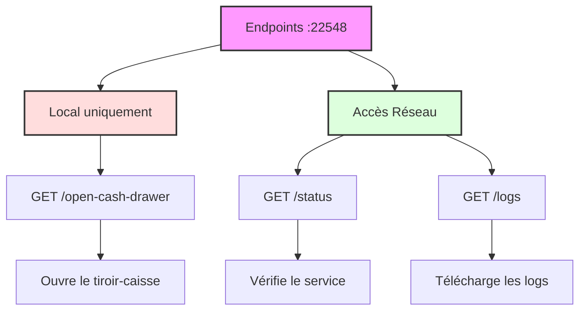
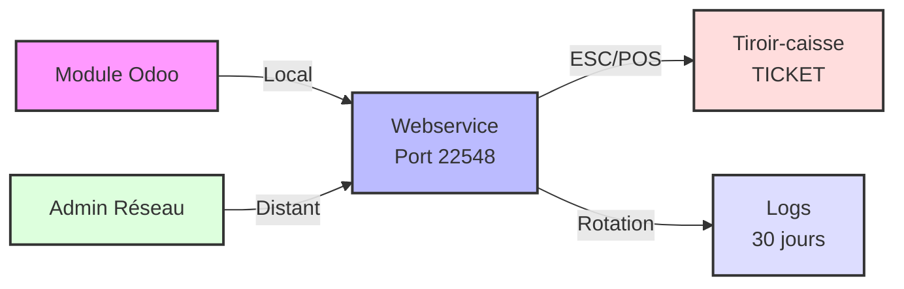

# Service Tiroir-Caisse pour Odoo POS

Ce service web permet de piloter l'ouverture d'un tiroir-caisse Epson via le protocole ESC/POS. Il est conçu pour fonctionner avec le module Odoo POS Cash Drawer Button.

## 🔧 Prérequis

- Python 3.8 ou supérieur
- Un tiroir-caisse compatible ESC/POS (testé avec Epson TMT88-V)
- Windows 7/8/10/11

## 📥 Installation

1. Cloner le repository ou télécharger les fichiers
2. Installer les dépendances :
```bash
pip install -r requirements.txt
```

## ⚙️ Configuration

Le service est configuré pour utiliser l'imprimante nommée "TICKET" sous Windows, qui est le nom standard utilisé dans votre parc d'imprimantes.

Si votre imprimante utilise un nom différent, vous pouvez le modifier dans le fichier `app.py` :
```python
printer = Win32('TICKET')  # Modifiez 'TICKET' par le nom de votre imprimante Windows
```

Pour vérifier le nom de votre imprimante :
1. Ouvrez les Paramètres Windows
2. Allez dans Imprimantes et scanners
3. Le nom affiché est celui à utiliser

## 🚀 Utilisation

### En tant que script Python

```bash
python app.py
```

### En tant qu'exécutable Windows

1. Générer l'exécutable :
```bash
python build.py
```

2. L'exécutable sera créé dans le dossier `dist`
3. Lancer `cashdrawer_service.exe`

Le service expose trois endpoints sur le port 22548 :



### Architecture du service



## 📝 Logs

Les logs sont générés dans le dossier `logs/cashdrawer.log` et contiennent :
- Date et heure de chaque ouverture
- Statut de l'opération
- Erreurs éventuelles
- Adresse IP des clients qui accèdent aux logs

Les logs sont automatiquement :
- Rotés chaque jour à minuit
- Conservés pendant 30 jours
- Accessibles via l'endpoint `/logs` depuis n'importe quelle machine du réseau

## 🔒 Sécurité

Le service est configuré avec deux niveaux d'accès :
- Local uniquement (127.0.0.1) pour l'ouverture du tiroir-caisse
- Accessible depuis le réseau pour la consultation des logs et du statut

Les endpoints sont sécurisés :
- `/open-cash-drawer` : Accessible uniquement en local
- `/status` et `/logs` : Accessibles depuis le réseau

Toutes les tentatives d'accès sont enregistrées dans les logs.

## 🛠️ Support et Maintenance

Pour toute question ou problème :
- Créez une issue sur GitHub
- Contactez le support technique

## 📄 Licence

Ce projet est sous licence MIT.
