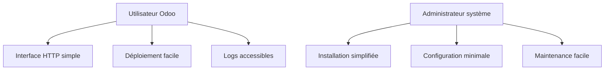
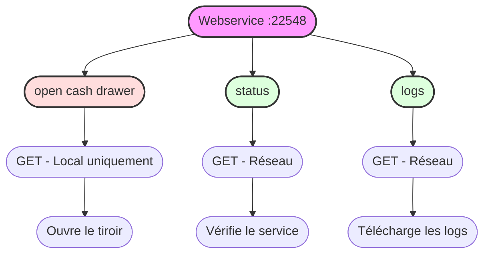
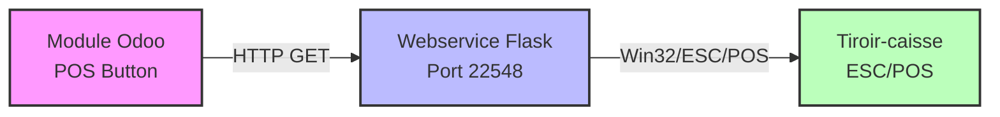
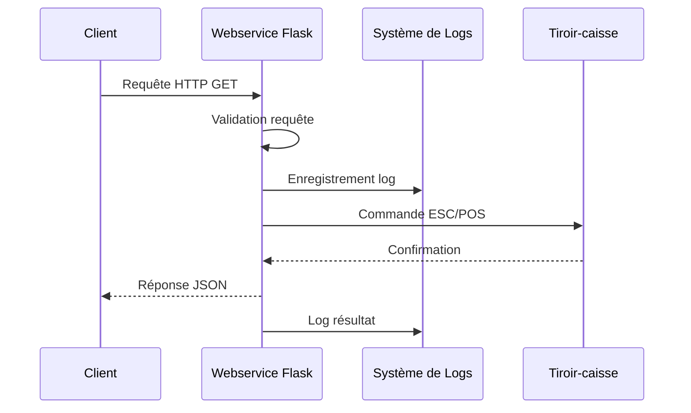

# Cahier des Charges : Webservice Tiroir-Caisse pour Odoo POS

## 📑 Table des matières
1. [Présentation du projet](#1-présentation-du-projet)
2. [Analyse des besoins](#2-analyse-des-besoins)
3. [Spécifications fonctionnelles](#3-spécifications-fonctionnelles)
4. [Spécifications techniques](#4-spécifications-techniques)
5. [Architecture technique](#5-architecture-technique)
6. [Contraintes](#6-contraintes)
7. [Livrables](#7-livrables)
8. [Tests et validation](#8-tests-et-validation)
9. [Maintenance](#9-maintenance)

## 1. Présentation du projet

### 1.1 Contexte
Dans le cadre de l'utilisation du Point de Vente (POS) Odoo avec le module POS Cash Drawer Button, un service local est nécessaire pour piloter l'ouverture physique du tiroir-caisse via le protocole ESC/POS.

### 1.2 Objectifs
- Fournir une interface HTTP locale pour l'ouverture du tiroir-caisse
- Assurer la compatibilité avec le module Odoo POS Cash Drawer Button
- Garantir la traçabilité des opérations via un système de logs
- Proposer une solution facile à déployer (script Python et exécutable Windows)

## 2. Analyse des besoins

### 2.1 Besoins utilisateurs


### 2.2 Besoins fonctionnels
- Endpoint HTTP pour l'ouverture du tiroir
- Vérification du statut du service
- Génération de logs pour chaque opération
- Support des imprimantes Windows nommées "TICKET"

### 2.3 Besoins techniques
- Communication ESC/POS fiable
- Performance optimale (temps de réponse < 500ms)
- Sécurité locale (localhost uniquement)
- Compatibilité Windows

## 3. Spécifications fonctionnelles

### 3.1 Endpoints API


### 3.2 Fonctionnalités principales
1. **Ouverture du tiroir**
   - Endpoint dédié
   - Protocole ESC/POS
   - Gestion des erreurs

2. **Vérification du statut**
   - Endpoint de monitoring
   - Réponse JSON
   - État du service

3. **Système de logs**
   - Horodatage
   - Type d'opération
   - Statut de l'opération
   - Messages d'erreur
   - Rotation quotidienne
   - Conservation 30 jours
   - Endpoint de téléchargement

## 4. Spécifications techniques

### 4.1 Architecture système


### 4.2 Technologies utilisées
- **Backend**
  - Python 3.8+
  - Flask (webservice)
  - python-escpos (protocole ESC/POS)
  - logging (gestion des logs)

- **Communication**
  - HTTP (non-SSL, localhost uniquement)
  - ESC/POS (protocole imprimante)

- **Déploiement**
  - Script Python
  - Exécutable Windows (PyInstaller)

### 4.3 Sécurité
- Double niveau d'accès :
  * Localhost uniquement pour l'ouverture du tiroir
  * Réseau pour les logs et le statut
- Validation des requêtes
- Logs sécurisés avec traçabilité des accès
- Journalisation des tentatives d'accès non autorisées

## 5. Architecture technique

### 5.1 Structure du projet
```
odoo_pos_cashdrawer_webservice/
├── app.py
├── build.py
├── requirements.txt
├── README.md
├── SPECS.md
└── logs/
    └── cashdrawer.log
```

### 5.2 Flux de données


## 6. Contraintes

### 6.1 Contraintes techniques
- Windows uniquement
- Python 3.8 minimum
- Imprimante nommée "TICKET"
- Port 22548 disponible et accessible
- Réseau configuré pour accès aux logs

### 6.2 Contraintes de performance
- Temps de réponse < 500ms
- Logs asynchrones avec rotation
- Conservation des logs pendant 30 jours
- Gestion des erreurs robuste

### 6.3 Contraintes d'exploitation
- Installation simple
- Configuration minimale
- Maintenance facilitée

## 7. Livrables

### 7.1 Documents
- Code source documenté
- README d'installation
- Cahier des charges (SPECS.md)
- Documentation API

### 7.2 Composants logiciels
- Script Python (app.py)
- Script de build (build.py)
- Exécutable Windows
- Fichiers de configuration

## 8. Tests et validation

### 8.1 Tests fonctionnels
- Ouverture du tiroir
- Vérification du statut
- Génération des logs
- Gestion des erreurs

### 8.2 Tests techniques
- Performance
- Stabilité
- Sécurité
- Compatibilité Windows

### 8.3 Critères d'acceptation
- Temps de réponse < 500ms
- Logs complets
- Pas d'erreurs critiques
- Installation réussie

## 9. Maintenance

### 9.1 Maintenance corrective
- Correction des bugs
- Mise à jour des dépendances
- Optimisations

### 9.2 Maintenance évolutive
- Nouvelles fonctionnalités
- Support d'autres systèmes
- Améliorations diverses

---

## 📝 Notes et références

### Contact
Pour toute question ou clarification :
- **Développeur** : Raphaël Auberlet
- **Email** : rauberlet.sdpma@sicalait.fr
- **GitHub** : [ralphi2811](https://github.com/ralphi2811)

### Versions du document
- Version 1.0 - Création initiale
- Version 1.1 - Ajout des diagrammes techniques
- Version 1.2 - Mise à jour des spécifications Windows
