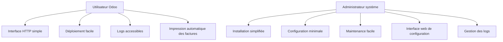
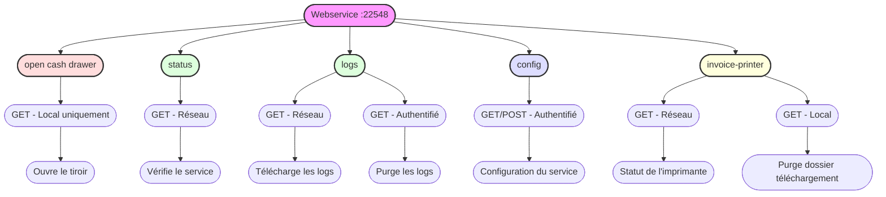
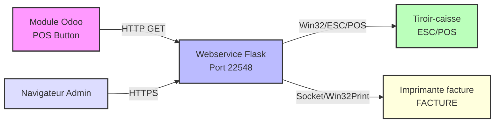
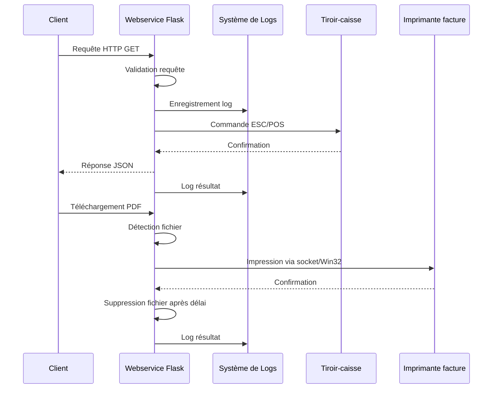

# Cahier des Charges : Webservice Tiroir-Caisse pour Odoo POS

## 📑 Table des matières
1. [Présentation du projet](#1-présentation-du-projet)
2. [Analyse des besoins](#2-analyse-des-besoins)
3. [Spécifications fonctionnelles](#3-spécifications-fonctionnelles)
4. [Spécifications techniques](#4-spécifications-techniques)
5. [Architecture technique](#5-architecture-technique)
6. [Contraintes](#6-contraintes)
7. [Livrables](#7-livrables)
8. [Tests et validation](#8-tests-et-validation)
9. [Maintenance](#9-maintenance)

## 1. Présentation du projet

### 1.1 Contexte
Dans le cadre de l'utilisation du Point de Vente (POS) Odoo avec le module POS Cash Drawer Button, un service local est nécessaire pour piloter l'ouverture physique du tiroir-caisse via le protocole ESC/POS.

### 1.2 Objectifs
- Fournir une interface HTTP locale pour l'ouverture du tiroir-caisse
- Assurer la compatibilité avec le module Odoo POS Cash Drawer Button
- Garantir la traçabilité des opérations via un système de logs
- Proposer une solution facile à déployer (script Python et exécutable Windows)
- Offrir une interface web de configuration sécurisée
- Permettre l'impression automatique des factures PDF

## 2. Analyse des besoins

### 2.1 Besoins utilisateurs


### 2.2 Besoins fonctionnels
- Endpoint HTTP pour l'ouverture du tiroir
- Vérification du statut du service
- Génération de logs pour chaque opération
- Support des imprimantes Windows nommées "TICKET"
- Interface web de configuration avec authentification
- Impression automatique des PDF téléchargés
- Purge et rotation des logs

### 2.3 Besoins techniques
- Communication ESC/POS fiable
- Performance optimale (temps de réponse < 500ms)
- Sécurité locale (localhost uniquement pour fonctions critiques)
- Compatibilité Windows
- Authentification sécurisée pour l'interface de configuration
- Stockage des configurations dans un emplacement dédié

## 3. Spécifications fonctionnelles

### 3.1 Endpoints API


### 3.2 Fonctionnalités principales
1. **Ouverture du tiroir**
   - Endpoint dédié
   - Protocole ESC/POS
   - Gestion des erreurs

2. **Vérification du statut**
   - Endpoint de monitoring
   - Réponse JSON
   - État du service

3. **Système de logs**
   - Horodatage
   - Type d'opération
   - Statut de l'opération
   - Messages d'erreur
   - Rotation quotidienne
   - Conservation 30 jours
   - Endpoint de téléchargement
   - Interface de purge des logs

4. **Interface de configuration**
   - Authentification sécurisée
   - Configuration du service
   - Configuration des imprimantes
   - Configuration des logs
   - Modification du mot de passe

5. **Impression automatique des factures**
   - Surveillance du dossier de téléchargement
   - Impression directe via socket réseau
   - Fallback sur l'impression Windows
   - Purge des fichiers après traitement

## 4. Spécifications techniques

### 4.1 Architecture système


### 4.2 Technologies utilisées
- **Backend**
  - Python 3.8+
  - Flask (webservice)
  - python-escpos (protocole ESC/POS)
  - logging (gestion des logs)
  - werkzeug (gestion HTTP/HTTPS)
  - win32print (gestion des imprimantes Windows)
  - bcrypt (authentification sécurisée)
  - socket (communication avec imprimantes réseau)
  - threading (traitement parallèle)

- **Frontend**
  - HTML/CSS/JavaScript
  - Templates Flask (interface de configuration)

- **Communication**
  - HTTP/HTTPS (support des deux protocoles)
  - ESC/POS (protocole imprimante)
  - Support des redirections HTTPS
  - Socket réseau (impression directe)

- **Sécurité**
  - Bcrypt pour le hachage des mots de passe
  - Sessions chiffrées
  - Protection CSRF
  - Restriction d'accès par adresse IP

- **Déploiement**
  - Script Python
  - Exécutable Windows (PyInstaller)
  - Dossier dédié pour la configuration et les logs

### 4.3 Sécurité
- Plusieurs niveaux d'accès :
  * Localhost uniquement pour l'ouverture du tiroir et purges
  * Réseau pour les logs et le statut
  * Authentification pour la configuration
- Validation des requêtes
- Logs sécurisés avec traçabilité des accès
- Journalisation des tentatives d'accès non autorisées
- Stockage sécurisé des mots de passe (bcrypt + sel)
- Sessions avec durée limitée (1 heure)

## 5. Architecture technique

### 5.1 Structure du projet
```
odoo_pos_cashdrawer_webservice/
├── app.py
├── build.py
├── requirements.txt
├── README.md
├── SPECS.md
├── CHANGELOG.md
├── static/
│   ├── css/
│   └── js/
├── templates/
│   ├── config.html
│   ├── layout.html
│   └── login.html
└── logs/
    └── cashdrawer.log
```

### 5.2 Structure des dossiers en mode exécutable (Windows)
```
C:\ProgramData\OdooPOS\
├── config.ini
└── logs\
    └── cashdrawer.log
```

### 5.3 Flux de données


## 6. Contraintes

### 6.1 Contraintes techniques
- Windows uniquement
- Python 3.8 minimum
- Imprimante tiroir-caisse nommée "TICKET"
- Port 22548 disponible et accessible
- Réseau configuré pour accès aux logs et à la configuration
- Dossier `C:\ProgramData\OdooPOS\` accessible en écriture

### 6.2 Contraintes de performance
- Temps de réponse < 500ms
- Logs asynchrones avec rotation
- Conservation des logs pendant 30 jours (configurable)
- Gestion des erreurs robuste
- Support des requêtes HTTP et HTTPS
- Gestion des redirections HTTPS depuis Odoo
- Traitement parallèle pour l'impression des factures

### 6.3 Contraintes d'exploitation
- Installation simple
- Configuration minimale
- Maintenance facilitée
- Interface de configuration intuitive
- Mise à jour simplifiée

## 7. Livrables

### 7.1 Documents
- Code source documenté
- README d'installation et d'utilisation
- Cahier des charges (SPECS.md)
- Documentation API
- Changelog des versions

### 7.2 Composants logiciels
- Script Python (app.py)
- Script de build (build.py)
- Exécutable Windows
- Fichiers de configuration
- Interface web de configuration
- Templates HTML/CSS

## 8. Tests et validation

### 8.1 Tests fonctionnels
- Ouverture du tiroir
- Vérification du statut
- Génération et purge des logs
- Gestion des erreurs
- Authentification et configuration
- Impression des factures

### 8.2 Tests techniques
- Performance
- Stabilité
- Sécurité
- Compatibilité Windows
- Gestion des chemins et permissions
- Traitement parallèle
- Récupération après erreur

### 8.3 Critères d'acceptation
- Temps de réponse < 500ms
- Logs complets
- Pas d'erreurs critiques
- Installation réussie
- Configuration fonctionnelle
- Impression fiable

## 9. Maintenance

### 9.1 Maintenance corrective
- Correction des bugs
- Mise à jour des dépendances
- Optimisations

### 9.2 Maintenance évolutive
- Nouvelles fonctionnalités
- Support d'autres systèmes
- Améliorations diverses
- Interface de configuration améliorée

---

## 📝 Notes et références

### Contact
Pour toute question ou clarification :
- **Développeur** : Raphaël Auberlet
- **Email** : rauberlet.sdpma@sicalait.fr
- **GitHub** : [ralphi2811](https://github.com/ralphi2811)

### Versions du document
- Version 1.0 - Création initiale
- Version 1.1 - Ajout des diagrammes techniques
- Version 1.2 - Mise à jour des spécifications Windows
- Version 1.3 - Ajout de l'interface de configuration et de l'impression des factures (1 mai 2025)
